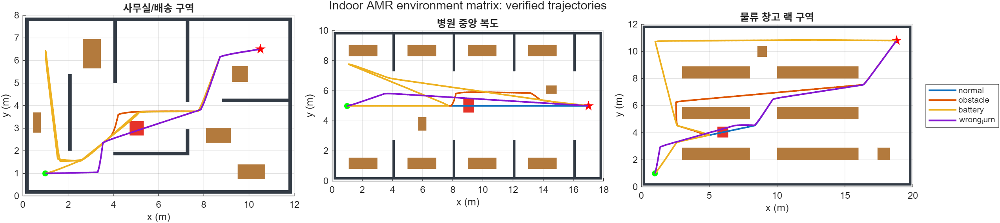
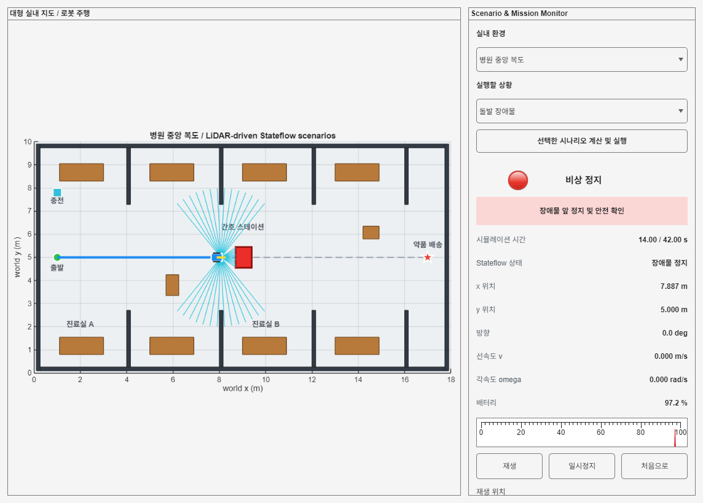

# Indoor Delivery AMR with MATLAB, Simulink, and Stateflow

ROS 2와 유료 로봇 툴박스 없이 MATLAB, Simulink, Stateflow만 사용해 실내 배송 AMR의 핵심 알고리즘과 상위 제어 구조를 직접 구현한 학습 프로젝트입니다.

이 저장소는 단순 경로 그림이 아니라 다음 수직 절편을 실행 가능한 형태로 연결합니다.

```text
Hierarchical/Parallel Stateflow Supervisor
                    ↓
Occupancy Grid → A* Global Planner
                    ↓
2D LiDAR → Local Costmap → DWA Local Planner
                    ↓
Independent Safety Gate
                    ↓
Differential-Drive Plant → Playback UI and Logs
```



## 주요 구현

- 차동구동 순·역기구학과 이산 pose 적분
- 사각형 floor map을 직접 rasterize하는 2D occupancy grid
- A* 전역 경로계획과 line-of-sight 경로 단순화
- 270도, 91 beam의 직접 구현한 2D LiDAR raycasting
- range noise, beam/frame dropout, 1-sample delay와 freshness watchdog
- LiDAR hit 기반 robot-centred local costmap
- dynamic window, trajectory rollout, braking admissibility를 포함한 DWA 계열 지역 계획기
- 로봇 footprint와 선분 이동을 검사하는 독립 collision/safety gate
- log-odds inverse range sensor mapping prototype
- `[x,y,theta]` pose EKF covariance와 localization-health prototype
- 계층 OR 상태와 병렬 AND 영역으로 구성한 실무형 Stateflow Supervisor
- MATLAB UI에서 지도, 로봇, LiDAR ray, 경로, 배터리와 상태를 재생

## 실내환경과 검증 상황

실제 특정 시설 도면을 복제하지 않은 자체 합성 지도 3개를 사용합니다.

- 사무실/배송 구역
- 병원 중앙 복도
- 물류 창고 랙 구역

각 환경에서 정상 배송, 돌발 장애물, 배터리 부족, 잘못된 길의 네 상황을 실행합니다.

| 검증 묶음 | 결과 |
| --- | --- |
| 알고리즘 단위검사 | 8개 runner 제공 |
| 환경 연결성·센서·mapping·EKF 핵심검사 | PASS |
| 3개 환경 × 4개 Scenario Lab | 12/12 PASS |
| 3개 환경 × 4개 통합 Stateflow 모델 | 12/12 PASS |
| Scenario/Integrated 모델 구조검사 | healthy |
| 최종 위치 오차 | 약 0.080 m 이하 |



## 요구 환경

- Windows 11에서 개발·검증
- MATLAB R2025b Update 5
- Simulink
- Stateflow

다음 제품은 사용하지 않습니다.

- ROS Toolbox
- Robotics System Toolbox
- Simulink Test
- ROS 2, Nav2, Gazebo

## 빠른 시작

MATLAB에서 저장소 루트로 이동한 뒤 실행합니다.

```matlab
projectRoot = setup_amr_project();
amrScenarioApp = launch_amr_scenario_ui("obstacle", "hospital");
```

전체 단위검사:

```matlab
unitSummary = run_unit_verification();
```

3개 환경 × 4개 주행 상황:

```matlab
environmentSummary = run_environment_matrix();
```

동일한 12개 조합의 통합 Stateflow 검증:

```matlab
integratedEnvironmentSummary = run_integrated_environment_matrix();
```

자세한 설치와 모델 실행 방법은 [Getting Started](docs/GETTING_STARTED.md)를 참고하십시오.

## 저장소 구조

```text
amr_robot_planning/
├─ setup_amr_project.m       MATLAB path 초기화
├─ src/+amr/                 재사용 가능한 알고리즘 패키지
├─ scripts/                  모델 생성, 실행, UI, 회귀검증
├─ models/                   Simulink/Stateflow 모델 4개
├─ tests/unit/               assert 기반 단위검사
├─ data/expected/            검증 기준 MAT 파일
└─ docs/
   ├─ THEORY_INDEX.md        14단계 이론·구현 학습 순서
   ├─ PROJECT_PLAN.md        전체 개발 계획과 완료 조건
   ├─ ARCHITECTURE.md        코드와 모델의 연결 구조
   ├─ RESULTS.md             검증 결과와 대표 화면
   ├─ stages/                단계별 이론·구현·진행 결과
   └─ references/            공개 출처
```

## 문서

- [이론 및 단계별 학습 색인](docs/THEORY_INDEX.md)
- [프로젝트 전체 계획](docs/PROJECT_PLAN.md)
- [시스템 아키텍처](docs/ARCHITECTURE.md)
- [Industrial Stateflow 구조](docs/INDUSTRIAL_STATEFLOW_ARCHITECTURE.md)
- [설계 결정 기록](docs/DECISIONS.md)
- [현재 구현 상태](docs/PROGRESS.md)
- [검증 결과](docs/RESULTS.md)
- [공개 출처](docs/references/공개_출처.md)

## 현재 한계

- global A*의 동적 장애물은 아직 known rectangle이며 local DWA만 scan-derived hit를 사용합니다.
- log-odds mapping과 pose EKF health는 독립 검증된 prototype으로, 아직 전체 주행 Plant/Supervisor에 연결하지 않았습니다.
- scan matching, loop closure, pose graph 기반 완전한 SLAM은 이론·구현 계획 단계입니다.
- UI는 solver와 실시간으로 co-simulation하지 않고 완료된 Simulink 로그를 재생합니다.
- 실제 센서, HIL, 안전 인증을 대신하지 않습니다.

라이선스는 아직 지정하지 않았습니다.
