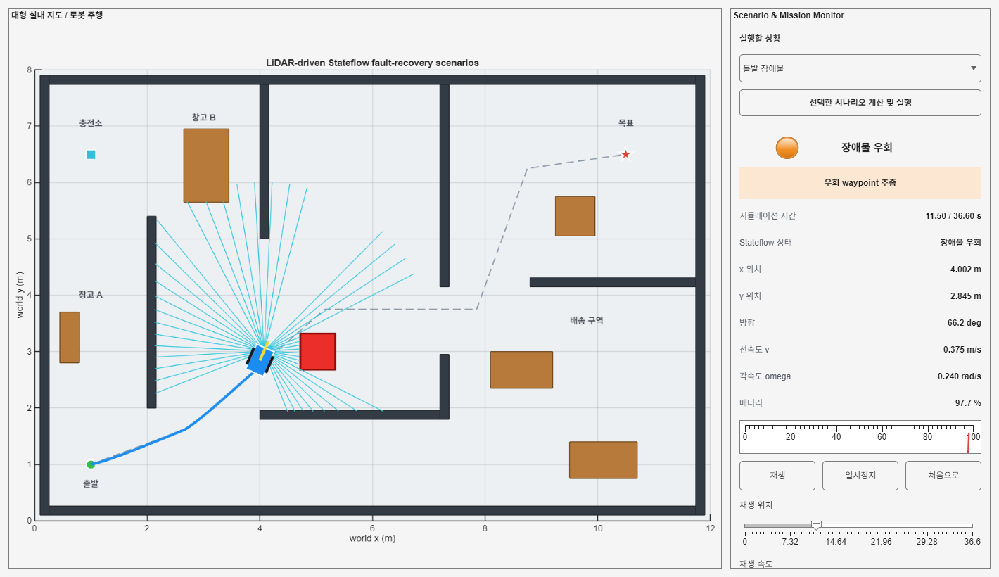
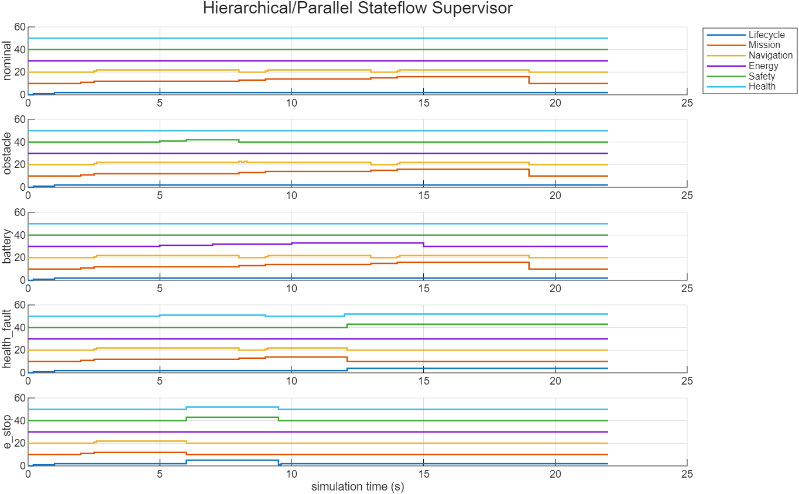
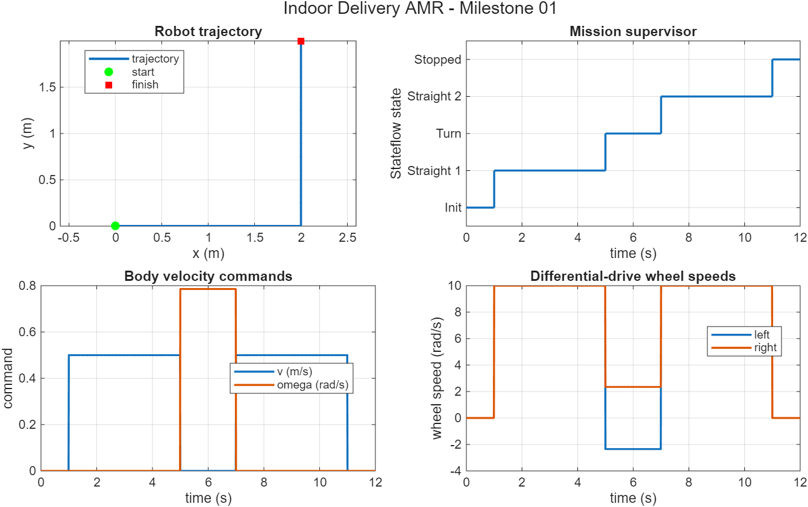
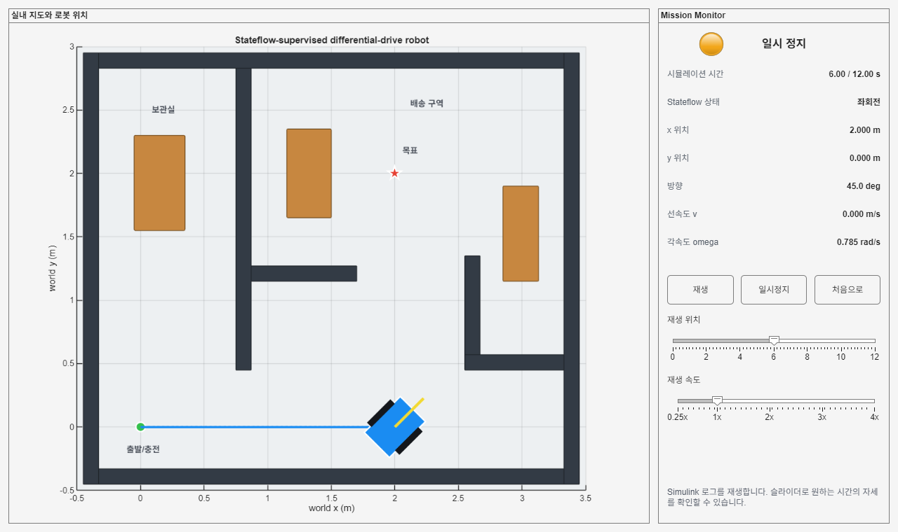

# 검증 결과

## 다중환경 Scenario Lab

| 환경 | 정상 | 돌발 장애물 | 배터리 부족 | 잘못된 길 |
| --- | ---: | ---: | ---: | ---: |
| 사무실/배송 구역 | 26.35 s | 34.40 s | 74.45 s | 35.05 s |
| 병원 중앙 복도 | 26.40 s | 40.00 s | 61.40 s | 35.20 s |
| 물류 창고 랙 구역 | 42.00 s | 56.50 s | 66.30 s | 51.65 s |

- 12개 조합 모두 `CollisionFree`, `LidarValidated`, `DwaValidated` PASS
- 최종 위치 오차 약 `0.080 m` 이하
- range noise, beam/frame dropout, delay와 freshness watchdog 포함

## UI 검증

병원 중앙 복도에서 동적 장애물이 protective-stop zone에 들어온 시점입니다. 로봇 전방의 LiDAR ray, 장애물, 기준 경로, Stateflow 정지 상태와 배터리를 함께 표시합니다.

사무실 환경의 LiDAR/local-costmap/DWA 통합 화면:

## Industrial Stateflow Supervisor

- lifecycle: PowerOff, Boot, Operational, ControlledShutdown, FaultLatched, EmergencyStopLatched
- Operational 병렬 영역: Mission, Navigation, Energy, Safety, Health
- nominal, obstacle, battery, health fault, emergency-stop 독립검사 PASS
- 다중환경 통합 12개 조합의 lifecycle `[0 1 2 3 0]`
- `NavFailed` 없이 종료

## Milestone 01

Stateflow 명령, 차동구동과 pose 적분을 연결한 최소 수직 절편의 결과입니다.

## 기준 데이터

재현 가능한 요약 구조체는 `data/expected/`에 보관합니다.

- `2026-07-20_milestone01_results.mat`
- `2026-07-21_industrial_supervisor_verification.mat`
- `2026-07-22_environment_matrix_verification.mat`
- `2026-07-22_integrated_environment_matrix.mat`

새 실행 결과는 Git에서 제외되는 로컬 `results/`에 생성됩니다.
